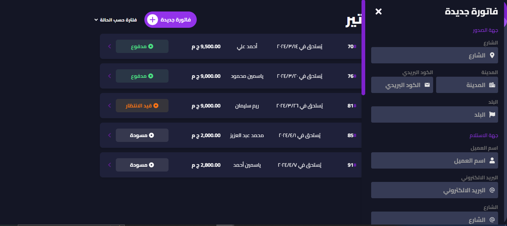
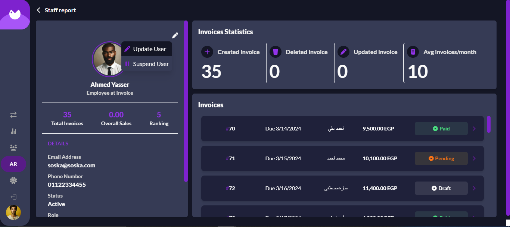

# Invoice Management App

## Overview

This Invoice Management App is designed to streamline invoice management processes, offering features for creating, reading, updating, and deleting invoices. With a comprehensive user management system and detailed monitoring of all invoice operations, it provides a robust solution for businesses. The app is built with a responsive design, offering support for English and Arabic languages, as well as both dark and light modes.


## Features

1. **CRUD Operations**: Create, Read, Update, and Delete invoices.
2. **User Management System**: Manage users within the application.
3. **Operation Monitoring**: Track all operations performed on invoices with admin access.

## Pages

1. **User Login Page**: Allows users to log in to the application.
   
2. **Invoices Overview Page**: Displays all invoices created by the user.
   
3. **Invoice Detail Page**: Provides detailed information for a single invoice.
   
4. **Invoice Creation Page**: Enables users to create new invoices.
   
5. **Users Overview Page**: Allows admins to view all users of the application.
   
6. **User Report Page**: Provides admins with a detailed report about each user.
   
7. **Dashboard**: Offers overall insights about invoices, users, and CRUD actions.
   
8. **Movements Page**: Records every CRUD operation performed on an invoice, accessible only to admins.
   

## Technologies Used

- **Frontend**:

  - HTML5
  - CSS3
  - Tailwind CSS
  - JavaScript
  - React JS
  - React Query
  - React Hook Forms

- **Backend**:
  - Supabase
  - PostgreSQL (for additional database functionalities)

## Installation

1. Clone the repository:

   ```bash
   git clone https://github.com/takieeldeen/invoices
   ```

2.Create supabase.js and supabaseAdmin.js files:

    Navigate to the ./src/services directory.

    Create a file named supabase.js for authorizer user:

    javascript
    Copy code
    // supabase.js
    import { createClient } from '@supabase/supabase-js';

    const supabaseUrl = 'YOUR_SUPABASE_URL';
    const supabaseKey = 'YOUR_SUPABASE_CLIENT_KEY';

    export const supabase = createClient(supabaseUrl, supabaseKey);
    Create another file named supabaseAdmin.js for admin user:

    javascript
    Copy code
    // supabaseAdmin.js
    import { createClient } from '@supabase/supabase-js';

    const supabaseUrl = 'YOUR_SUPABASE_URL';
    const supabaseKey = 'YOUR_SUPABASE_ADMIN_KEY';

    export const supabaseAdmin = createClient(supabaseUrl, supabaseKey);
    Make sure to replace 'YOUR_SUPABASE_URL', 'YOUR_SUPABASE_CLIENT_KEY', and 'YOUR_SUPABASE_ADMIN_KEY' with your actual Supabase URL and API keys.

3.Run the app:
npm start

Contributing
Contributions are welcome! If you'd like to contribute to this project
